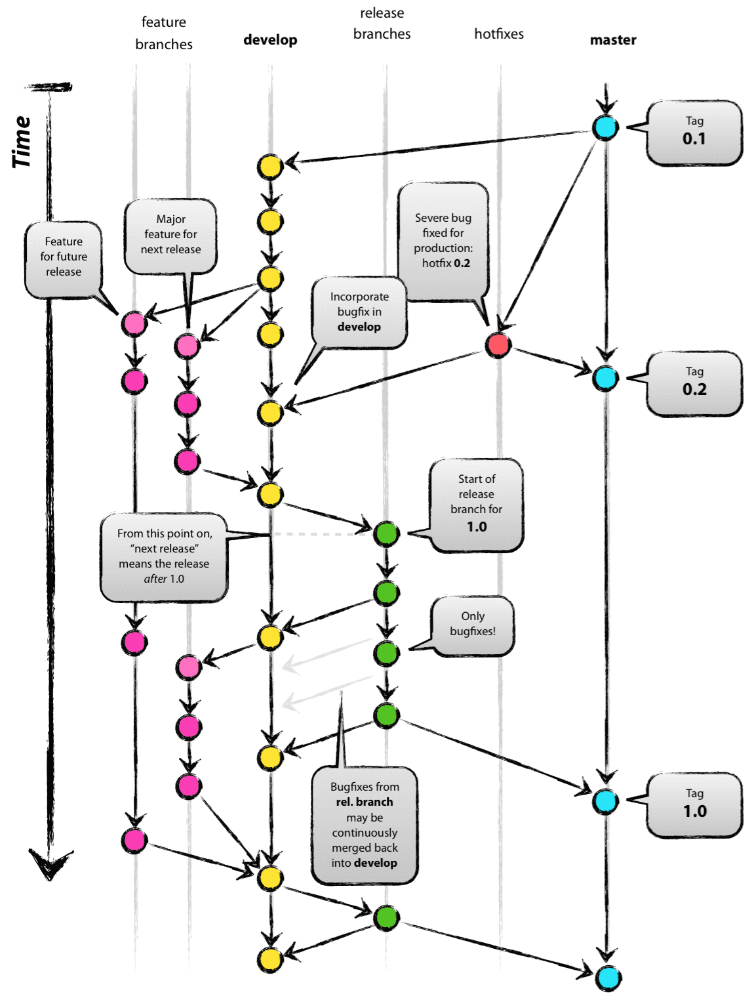

# gitflow_sourcetree
> 목표 - git을 활용한 협업을 도와주는 git-flow에 대한 이해와, 적용해보며 연습하기

## 사전 지식
1. git에 대한 기초적 이해
2. SW 개발 프로세스에 대한 간단한 지식

## git-flow란?
> **git-flow는 프로그램이 아니다!**

git-flow는 그동안 개발자들이 수동으로 관리해 왔던 개발 프로세스를 좀 더 쉽고, 효율적으로 만들도록 도와주는 git의 확장이라고 볼 수 있다. 개발에 맞는 각각의 독립된 브랜치를 자동으로 관리해주기 때문에 쉽고 더 간편하게 SW개발을 진행할 수 있다.

## git-flow 흐름 이해하기
git-flow에서는 총 5개의 브랜치를 통해 개발이 이루어진다. 항상 유지되는 2개의 브랜치(master,develop)와 일정 개발 기간 동안만 유지되는 3개의 보조 브랜치(feature,release,hotfix)로 이루어져 있다. 

### 1. Master(main) branch
#### *제품으로 출시될 수 있는 브랜치*
실제로 운용중인 배포(Release) 버전을 관리하는 브랜치. 배포 가능한 상태만을 관리한다. develop와 release, hotfix 브랜치로부터 만들어진 완벽한 프로그램을 관리한다고 보면 된다. 아래 그림에서 하늘색 노드들이 관리되는 branch를 보면 된다.

### 2. Devleop branch
#### *다음 출시 버전을 개발하는 브랜치*
개발자들이 평소에 이 develop 브랜치를 기반으로 개발을 진행하게 된다. 개발하는 기능들은 feature 브랜치에 새로 생성해서 독립적으로 개발한 뒤 develop 브랜치로 병합(merge)된다. 모든 기능(feature)들이 개발되고 면 release 브랜치로 병합되어 버그 테스트가 진행되고 문제가 없다면 master(main) 브랜치로 병합된다. 아래 그림에서 보라색 노드들이 관리되는 branch를 보면 된다.

### 3. Feature branch
#### *기능을 개발하는 브랜치*
develop 브랜치에서 새로운 기능을 개발하거나 버그 수정이 필요할 떄 마다 feature 브랜치로 분기하게 된다. feature 브랜치에서의 작업은 기본적으로 공유할 필요가 없기 때문에, 자신의 로컬 저장소에서 관리한다. 아래 그림의 초록색 노드들이 포함된 브랜치를 보면 된다.

1. develop 브랜치에서 새로운 기능에 대한 feature 브랜치 분기
2. 새로운 기능에 대한 개발 수행
3. 기능 개발 작업이 끝나면 develop 브랜치로 병합
4. 해당 기능을 담당하는 feature 브랜치 삭제
5. 병합된 develop 브랜치를 원격 저장소에 push

### 4. Release branch
#### *master 브랜치로 보내기 전에 마지막 품질 검사, 테스트 등을 진행하는 브랜치*
배포를 위한 전용 브랜치를 사용함으로써 한 팀이 배포를 준비하는 동안 다른 팀은 배포를 위한 기능 개발을 지속할 수 있다. 아래 그림의 청록색 노드들이 포함된 브랜치를 확인하면 된다.

1. develop 브랜치에서 개발 기능들이 모여 배포할 수준의 기능이 모이면 release 브랜치를 분기한다.
2. release 브랜치에서 배포 가능한 상태(모든 기능이 정상적으로 동작하는 상태)가 되면, master(main) 브랜치로 병합한다. 이 때, 버전 Tag를 부여해 주어야 한다.

### 5. Hotfix branch
#### *출시 버전에서 발생한 버그를 수정하는 브랜치*
배포한 버전에 **긴급하게** 수정을 해야 할 필요가 있을 경우, master 브랜치에서 분기해서 작업을 하게 되는 브랜치. develop 브랜치의 문제가 되는 부분을 수정하여 배포 가능한 버전을 만들기에는 시간이 많이 소요되고 안정성을 보장하기도 어렵기 때문에 지금 당장의 master 브랜치에서 분기해 필요한 부분만을 수정한 후 다시 병합한다.

1. 배포한 버전에 문제가 있을 경우 hotfix 브랜치 분기
2. 문제가 되는 부분을 빠르게 수정
3. master(main)브랜치에 병합 후 새로운 버전 태그를 선정

버그 수정만을 위한 hotfix 브랜치를 따로 만들었기 때문에, 다음 배포를 위해 작업하던 다른 브랜치(develop 및 거기서 분기된 브랜치들)에 영향을 주지 않는다.

## git-flow 활용해보기(ft.sourcetree)
간단한 git 활용 도구인 sourcetree를 사용해 git-flow를 활용해볼 수 있다.

### 1. github 원격 reposiory 생성
### 2. sourcetree를 사용해 로컬 저장소로 clone

### 3. 상단의 깃플로우 탭 클릭 후 저장소 초기화 실행

